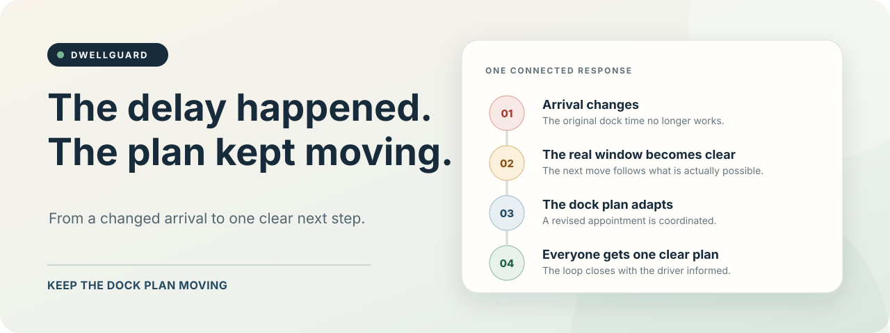
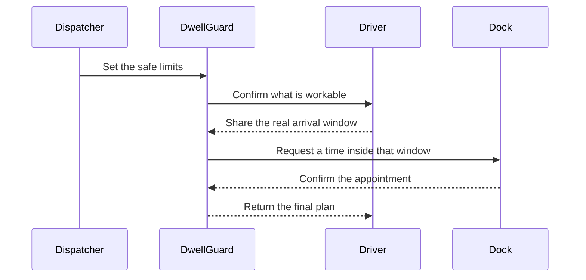

  

# DwellGuard

> **A late truck should not leave four people chasing four different versions of the plan.**

DwellGuard turns a changed arrival into a driver-approved, dock-confirmed appointment. It keeps the limits, the calls, and the handoff connected so everyone knows what happens next.

## One change. One plan.

Most delay tools tell you something went wrong. DwellGuard carries the work forward.

## What makes it different

The first call does not become a forgotten note. It changes the second call.

DwellGuard stays inside the dispatcher's authority, checks the dock's answer against the driver's real window, and shows why the final appointment is valid. If the evidence does not line up, it stops and asks for a person.

| Listen | Coordinate | Prove |
| --- | --- | --- |
| Capture the driver's real limits. | Ask the dock for a workable commitment. | Return one receipt with a clear evidence chain. |

## The result

- Fewer repeat calls.
- No quiet guesswork about time or fees.
- One plan for dispatch, driver, and dock.
- A clean handoff when a person needs to step in.

  <strong>DwellGuard. Keep the dock plan moving.</strong>

  Released under the <a href="./LICENSE">MIT License</a>.

