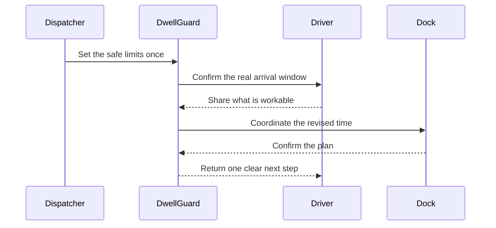

  

# DwellGuard

> **Freight delays do not need another alert. They need a plan people can actually follow.**

DwellGuard helps dispatchers, drivers, and receiving docks respond as one connected chain. When an arrival changes, the driver's real window shapes the next move—and the agreed plan comes back clearly to the people who need it.

## One update should move the whole plan

Most delay tools stop after reporting what went wrong. DwellGuard carries the change forward.

## The difference is in the handoff

**The first conversation does not end as a note. It changes what happens next.**

DwellGuard keeps each step connected, stays inside the dispatcher's limits, and makes it clear when a person still needs to decide.

| Understand | Coordinate | Close the loop |
| --- | --- | --- |
| Capture what has actually changed. | Turn the workable window into the next move. | Bring the agreed plan back to the driver. |

## What that means

- Fewer repeated calls and conflicting updates.
- A clear boundary between what is agreed and what still needs attention.
- One plan that dispatch, driver, and dock can understand.

---

  <strong>DwellGuard — Keep the dock plan moving.</strong>

  Released under the <a href="./LICENSE">MIT License</a>.

