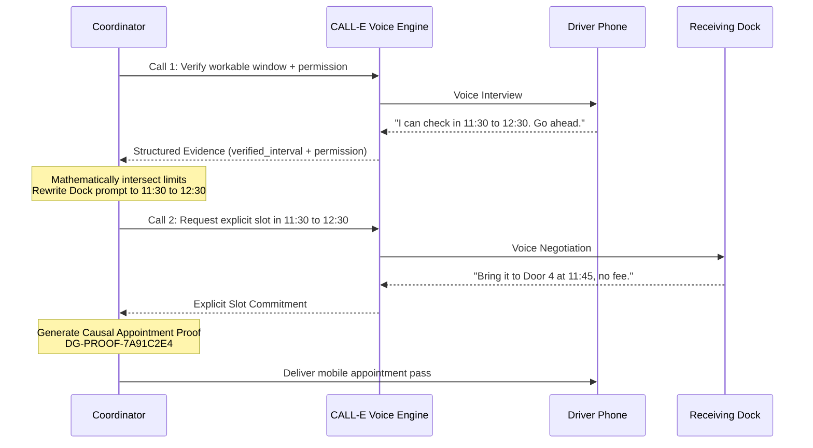

# Spoken Constraint Relay: CALL-E Pattern

A reusable, production-tested pattern for `@call-e/calle` that coordinates dependent sequential phone calls:
**A recipient's spoken boundaries in Call 1 visibly constrain and rewrite the operational request in Call 2.**

## Problem

Voice agents often perform isolated, disconnected calls. In supply chain coordination, dispatching a dock confirmation call before verifying the driver's real workable arrival window results in missed appointments, rescheduled deliveries, and unapproved detention fees.

## The Spoken Constraint Relay Pattern



## Guarantees

1. **Sequential Authority Boundary:** Call 2 is never dispatched until Call 1 returns verified interval limits and explicit permission.
2. **Causal Auditability:** Every confirmed outcome produces a deterministic SHA-256 hash and display ID (`DG-PROOF-xxxxxxxx`) from operational facts with zero PII, phone numbers, or private audio transcripts.
3. **Fail-Closed Security:** If a facility quotes a fee over the authorized ceiling or a slot outside the driver's window, the transaction safely terminates as `human_dispatcher_needed` rather than committing an unauthorized agreement.

## Quick Start

```typescript
import { CalleClient } from "@call-e/calle";
import { executeSpokenConstraintRelay } from "./relay";

const client = new CalleClient({
  apiKey: process.env.CALLE_API_KEY!,
  baseUrl: "https://api.heycall-e.com",
});

const result = await executeSpokenConstraintRelay({
  incidentId: "inc_1049",
  loadRef: "LD-9901",
  driverPhone: "+1555018888",
  dockPhone: "+1555019999",
  dockName: "Apex Receiving",
  earliestAllowed: "2026-09-14T11:00:00-04:00",
  latestAllowed: "2026-09-14T13:00:00-04:00",
  feeCeiling: 150,
  timezone: "America/New_York",
}, client);

if (result.success) {
  console.log(`Confirmed: ${result.confirmedTime} at ${result.designatedDoor}`);
  console.log(`Causal Proof ID: ${result.causalProofId}`);
}
```

## Testing Offline

The included `fixtures.ts` and `relay.test.ts` allow zero-telephony testing:

```bash
npm test contrib/spoken-constraint-relay/relay.test.ts
```
